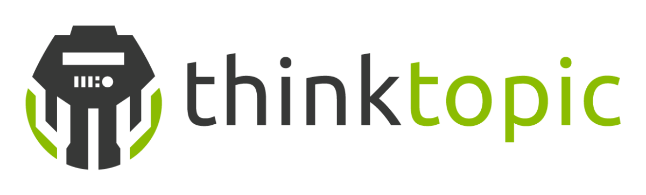

#  Onyx

[](https://gitter.im/onyx-platform/onyx?utm_source=badge&utm_medium=badge&utm_campaign=pr-badge&utm_content=badge)

### What is it?

- a masterless, cloud scale, fault tolerant, high performance distributed computation system
- batch and stream hybrid processing model
- exposes an information model for the description and construction of distributed workflows
- Competes against Storm, Cascading, Cascalog, Spark, Map/Reduce, Sqoop, etc
- written in pure Clojure

### What would I use this for?

- Realtime event stream processing
- Continuous computation 
- Extract, transform, load
- Data transformation à la map-reduce
- Data ingestion and storage medium transfer
- Data cleaning

### Installation

Available on Clojars:

```
[org.onyxplatform/onyx "0.8.4-SNAPSHOT"]
```

### Build Status

Component | `0.8.x`| `master`
----------|--------|--------
onyx core | [](https://circleci.com/gh/onyx-platform/onyx/tree/0.8.x) | [](https://circleci.com/gh/onyx-platform/onyx/tree/master)
onyx-kafka| [](https://circleci.com/gh/onyx-platform/onyx-kafka/tree/0.8.x) | [](https://circleci.com/gh/onyx-platform/onyx-kafka/tree/master)
onyx-datomic  | [](https://circleci.com/gh/onyx-platform/onyx-datomic/tree/0.8.x) | [](https://circleci.com/gh/onyx-platform/onyx-datomic/tree/master)
onyx-redis| [](https://circleci.com/gh/onyx-platform/onyx-redis/tree/0.8.x) | [](https://circleci.com/gh/onyx-platform/onyx-redis/tree/master)
onyx-sql  | [](https://circleci.com/gh/onyx-platform/onyx-sql/tree/0.8.x) | [](https://circleci.com/gh/onyx-platform/onyx-sql/tree/master)
onyx-bookkeeper  | [](https://circleci.com/gh/onyx-platform/onyx-bookkeeper/tree/0.8.x) | [](https://circleci.com/gh/onyx-platform/onyx-bookkeeper/tree/master)
onyx-seq| [](https://circleci.com/gh/onyx-platform/onyx-seq/tree/0.8.x) | [](https://circleci.com/gh/onyx-platform/onyx-seq/tree/master)
onyx-durable-queue| [](https://circleci.com/gh/onyx-platform/onyx-durable-queue/tree/0.8.x) | [](https://circleci.com/gh/onyx-platform/onyx-durable-queue/tree/master)
onyx-elasticsearch| [](https://circleci.com/gh/onyx-platform/onyx-elasticsearch/tree/0.8.x) | [](https://circleci.com/gh/onyx-platform/onyx-elasticsearch/tree/master)

### Companies Running Onyx in Production


&nbsp;&nbsp;&nbsp;&nbsp;&nbsp;&nbsp;&nbsp;&nbsp;&nbsp;&nbsp;&nbsp;&nbsp;&nbsp;&nbsp;&nbsp;&nbsp;&nbsp;&nbsp;



### Quick Start Guide

Feeling impatient? Hit the ground running ASAP with the [onyx-starter repo](https://github.com/onyx-platform/onyx-starter) and [walkthrough](https://github.com/onyx-platform/onyx-starter/blob/0.8.x/WALKTHROUGH.md). You can also boot into preloaded a Leiningen [application template](https://github.com/onyx-platform/onyx-template).

### User Guide 0.8.4-SNAPSHOT

- [User Guide HTML](http://onyx-platform.gitbooks.io/onyx/content/)
- [User Guide PDF](https://www.gitbook.com/download/pdf/book/onyx-platform/onyx)
- [User Guide Website](http://onyx-platform.gitbooks.io/onyx)
- [Cheat Sheet](http://www.onyxplatform.org/cheat-sheet.html)

### Developer's Guide 0.8.4-SNAPSHOT

- [Branch Policy](doc/developers-guide/branch-policy.md)
- [Release Checklist](doc/developers-guide/release-checklist.md)
- [Deployment Process](doc/developers-guide/deployment-process.md)

### API Docs 0.8.4-SNAPSHOT

Code level API documentation [can be found here](http://www.onyxplatform.org/api/0.8.4-SNAPSHOT).

### Official plugin listing

Official plugins are vetted by Michael Drogalis. Ensure in your project that plugin versions directly correspond to the same Onyx version (e.g. `onyx-core-async` version `0.8.4-SNAPSHOT` goes with `onyx` version `0.8.4-SNAPSHOT`). Fixes to plugins can be applied using a 4th versioning identifier (e.g. `0.8.4-SNAPSHOT.1`).

- [`onyx-core-async`](doc/user-guide/core-async-plugin.md)
- [`onyx-kafka`](https://github.com/onyx-platform/onyx-kafka)
- [`onyx-datomic`](https://github.com/onyx-platform/onyx-datomic)
- [`onyx-redis`](https://github.com/onyx-platform/onyx-redis)
- [`onyx-sql`](https://github.com/onyx-platform/onyx-sql)
- [`onyx-bookkeeper`](https://github.com/onyx-platform/onyx-bookkeeper)
- [`onyx-seq`](https://github.com/onyx-platform/onyx-seq)
- [`onyx-durable-queue`](https://github.com/onyx-platform/onyx-durable-queue)
- [`onyx-elasticsearch`](https://github.com/onyx-platform/onyx-elasticsearch)

Generate plugin templates through Leiningen with [`onyx-plugin`](https://github.com/onyx-platform/onyx-plugin).

### 3rd Party plugin listing

Unofficial plugins have not been vetted.
- [`onyx-rethink`](https://github.com/cddr/onyx-rethink)

### Offical Dashboard and Metrics

You can run a dashboard to monitor Onyx cluster activity, found [here](https://github.com/lbradstreet/onyx-dashboard). Further, you can collect metrics and send them to the dashboard, or anywhere, by using the [onyx-metrics plugin](https://github.com/onyx-platform/onyx-metrics).

### Need help?

Check out the [Onyx Google Group](https://groups.google.com/forum/#!forum/onyx-user).

### Want the logo?

Feel free to use it anywhere. You can find [a few different versions here](https://github.com/onyx-platform/onyx/tree/0.8.x/resources/logo).

### Running the tests

A simple `lein test` will run the full suite for Onyx core.

#### Contributor list

- [Michael Drogalis](https://github.com/MichaelDrogalis)
- [Lucas Bradstreet](https://github.com/lbradstreet)
- [Owen Jones](https://github.com/owengalenjones)
- [Bruce Durling](https://github.com/otfrom)
- [Malcolm Sparks](https://github.com/malcolmsparks)
- [Bryce Blanton](https://github.com/bblanton)
- [David Rupp](https://github.com/davidrupp)
- [sbennett33](https://github.com/sbennett33)
- [Tyler van Hensbergen](https://github.com/tvanhens)
- [David Leatherman](https://github.com/leathekd)
- [Daniel Compton](https://github.com/danielcompton)
- [Jeff Rose](https://github.com/rosejn)
- [Ole Krüger](https://github.com/dignati)
- [Juho Teperi](https://github.com/Deraen)
- [Nicolas Ha](https://github.com/nha)
- [Andrew Meredith](https://github.com/kendru)
- [Bridget Hillyer](https://github.com/bridgethillyer)
- [Ivan Mushketyk](https://github.com/mushketyk)
- [Jochen Rau](https://github.com/jocrau)

#### Acknowledgements

Some code has been incorporated from the following projects:

- [Riemann] (https://github.com/aphyr/riemann)
- [zookeeper-clj] (https://github.com/liebke/zookeeper-clj)

### License

Copyright © 2015 Michael Drogalis

Distributed under the Eclipse Public License, the same as Clojure.

### Profiler


YourKit supports open source projects with its full-featured Java Profiler.
YourKit, LLC is the creator of <a href="https://www.yourkit.com/java/profiler/index.jsp">YourKit Java Profiler</a>
and <a href="https://www.yourkit.com/.net/profiler/index.jsp">YourKit .NET Profiler</a>,
innovative and intelligent tools for profiling Java and .NET applications.
