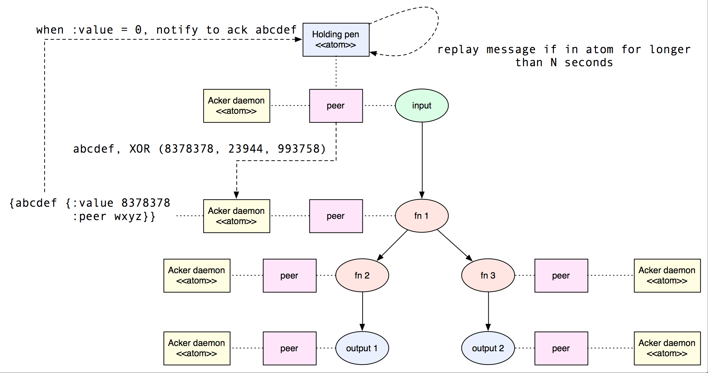

## Messaging

This design document outlines the new approach that Onyx will take in implementing messaging from 0.6.0 forward.
For a refresher of how Onyx messaging works as of 0.5.0, please refer to the Internal Design section of the User Guide.

### The pros of using a message broker

As of 0.5.0, Onyx uses the HornetQ message broker for communication. There are certainly some benefits to this approach:

- Provides a mechanism for built-in message acknowledgement
- Provides a mechanism for built-in message grouping
- Out of the box load balacing strategies for both the server and the client
- Built-in failover and replication, bugs are HornetQ's problem, not mine

### The cons of using a message broker

- While bugs in HornetQ may be JBoss's problem, they're also sort of mine, because they affect my product
- We write to disk way too much as a result of transactionally moving messages between tasks
- Need to scale the message brokers alongside peers - an operational burden on the developer
- Good fault tolerance requires replication, increasing latency by a constant factor per replica
- Setting up HornetQ is an operational concern by itself
- Configuring HornetQ is hard
- Transactional message movement doesn't matter nearly as much as I thought it might

### An alternate solution

One proposed solution is to copy-cat Apache Storm. Storm is very fast, and uses an in-memory algorithm
to implement fault tolerancy using ordinary HTTP. This boils down to the following large pieces:

- Each peer runs a lightweight HTTP server and client
- We move what it means to "acknowledge" and "replay" a segment to an interface that the input medium implements
- We use multiple, independent "acker server routes" across different peers to manage the success and fail of segments

Let's try a visual description. I'll take you through every piece of this below.

There are 5 nodes in this workflow. An input, three functions, and two outputs. Every peer runs an acknowledgment daemon, which runs inside a lightweight webserver. As each message flows into Onyx, it's given a unique ID. The ID is mapped to the segment, and it's held inside the "holding pen" on the input for N seconds. In this example, ID `abcdef` is mapped to a specific segment.

The peer executing the input task then takes the segment and assigns it a random bit pattern. Let's say it starts with bit pattern `837878`. It uses the segment's ID, `abcdef`, and hashes it to a particular peer. In this example, segment `abcdef` hashes to the peer executing `fn 1`. The peer executing the input task sends a message to the peer executing `fn 1` that the input's peer's id is `wxyz`, that the segment's id to report is `abcdef`, and that it should XOR the existing value with the bit patterns `837878`, `23944`, and `993758`. `837878` represents acknowledging the completion of the segment on the input task, and the other two values are new random bit patterns that represent two new segments being created. These bit patterns are repeated when the segments are acked again. The acker daemon receives this message. When it's processed, it checks to see if the result value of XOR'ing is 0. If it is, it sends a message to the holding pen to acknowledge that segment `abcdef` is finished, and should be released.

If N seconds pass and no one acknowledges the message in the holding pen, the `replay` interface function is invoked to try it again (it timed out), and the segment is removed from the holding pen. If the holding pen receives a message to acknowledge the segment, the `ack` interface function is invoked, and this segment gets removed from the holding pen.

I'll next outline the work that needs to be completed to achieve this approach.

#### Messaging infrastructure on each peer

Add the necessary code to each peer when it starts up with component to receive messages. For the first interation, that means booting up an HTTP-Kit server. Also ensure that any code needed to send messages to other peers get the chance to boot up.

#### Ack/replay interface

Create an interface for what it means to "ack" and "replay" a segment for a specific input medium. This used to be handled by HornetQ, but now we're pushing it right into the input medium.

#### Ack/replay for batch storage

Define how to "ack" and "replay" segments for input mediums that don't provide it out of the box (e.g. SQL).

#### Ensure full execution path

Replica logic needs to be redefined to disallow any peer taking a job unless at least 1 peer per task can also join it. Otherwise messages would just get sent to no where and time out, pointlessly.

#### Stall task lifecycle execution

Redefine peer logic to not start a peer lifecycle until it receives confirmation that at least one peer per task is ready. Even though the job may have enough peers, make sure all peers actually decide to take the job before starting task execution. Otherwise segments will be sent to nowhere and timeout.

#### Back off policies

Implement back-off policies for peer's failing sending segments to each other. A peer might temporarily be unavailable, or slow to respond. We'll use core.async channels on the receiving and sending side of a peer to buffer message flow.

#### Create an interface for sending/receiving messages

We want this to be pluggable, so make sure this is behind an interface.

#### Ensure that grouping is undisturbed

Redefine peer logic to *never* add new peers to a grouping task after a job has been started - this would throw off the hash-mod'ing algorithm. If a peer fails, it can continue though. Storm does the same thing and makes sure all messages will be sticky to a new peer.

#### Implement a holding pen

Add an atom to any task lifecycle for an input as a "container-pen" for objects that need to be natively acked. (e.g. real HornetQ ack)

#### Implement replay timer

Add a timer-based job to every input task that releases segments in the "container-pen" that time out and need to be replayed.

#### Implement an Acker daemon

Add an "acker" route on *every* peer web server to perform Onyx-specific message acknowledgment. Make sure this gets booted up alongside the peer.

#### Add acking atom

Add an atom to every peer's acking machinery as a "container-pen" for segments that need to be ack'ed via Onyx with bit-patterns.

#### XOR algorithm

Implement XOR algorithm in peer's acking thread as described above.

#### Implement load balancing

Implement a load balancing algorithm for spreading out messages over a range of peer's for downstream tasks.

### Implementation plan

- [x] Add a new component to all peers - MessagingBuffer.
  - [x] New channel for inbound messages
  - [x] Fixed sized buffer, make configurable
- [x] Add `send-message` and `receive-message` to `onyx.extensions`.
  - [x] Implement in folder named `messaging`.
  - [x] Add an `http-kit` file to this folder, implement send/receive message
- [x] Make a map of keyword to function that returns a new Component
  - [x] `:http-kit` -> New HttpKit server
  - [x] Use this for when the peers boots up
  - [x] Make sure the result of this gets passed into the peer task lifecycle
  - [x] Use this for receiving messages
  - [x] Do the same, make a Component for sending messages, make sure it gets the receiver as a parameter in case it needs it
- [x] Strip out all pipelining. I want to start from scratch and tune performance from the ground up
- [x] Add an Acker component to every peer
  - [x] Listens for ack messages, contains an atom as described above
  - [x] This should be part of the interface for any messaging implementations
  - [x] Reuse existing booted up messaging components
- [x] Add a holding pen to all input tasks
  - [x] Add an atom to maintain the holding pen
  - [x] Make sure a future is running to periodically clear the atom out
  - [x] Do the same as above wrt to reusing messaging components, needs to come through the same interface
- [x] Implement HornetQ first, straightforward semantics

### Full job coverage notes

One part of the implementation that requires further analysis are the mechanics for ensuring that every job has at least 1 peer assigned to each task while it's executing. If this weren't the case, at least one peer wouldn't have a downstream peer to send messages to - resulting in no work being accomplished. It ends up that the way to handle this is job scheduler specific, and affects any log command who's reactive capabilities include volunteering a peer for a new task. We'll consider each job scheduler in turn, and within construct a plan for handling each command.

#### Greedy job scheduler

The Greedy job scheduler has the interesting property that all peers must be assigned to the same job. We can exploit this property and use the number of peers to figure out whether a peer should assign to a new job.

##### Submit new job

When a new job comes in, either a job is already running and *no* peers react with a `volunteer-for-task` call, or there are no jobs currently running. In the latter case, the reactive function should look at the number of tasks in the job and compare it to the number of `:peers` in the replica. If there are at least as many peers are tasks, all peers should react with `volunteer-for-task`. `volunteer-for-task` also needs to perform this check, as the number of peers may have changed since the log entry was appended.

##### Killed job

If the killed job is not the job that all peers are currently executing, no reactions should happen. If it is, look at each job in the order it was submitted. The reactive function should look at the number of tasks in the job and compare it to the number of `:peers` in the replica. If *any* satisy the coverage property, all peers should react with `volunteer-for-task`. `volunteer-for-task` should perform the same check, never assigning a peer to a job who's tasks outnumber the total number of peers. It's critical to do this second check, because inbetween the time the original job was killed and the request for new work was processed, peers may have joined or left the cluster. Consider jobs in the order they were submitted.

##### Completed task

If the task that was completed was not the last task to be finished in the job, no reactions should happen. Otherwise, this job has no tasks left, and should follow the logic of killed job.

##### Accept join cluster

Same logic as submit new job.

##### Seal task

Same as completed task.

##### Leave cluster

If there isn't at least 1 peer per task after a node has left the cluster on this peer's job, this peer should stop executing this job.

#### Round Robin job scheduler

The Round Robin job scheduler can leverage the deterministic property of reactive functions. Here, we look at how all peers *would* react under particular circumstances, then make an actual decision based off that. It lets us do a bit of time travel, if you will.

##### Submit new job

When a new job drops in, each peer reacts and looks at how many peers in total *would* volunteer for a new task. If that number is less than the number of tasks, no reactions happen. If that number is at least as high, all volunteer reactions go through.

##### Killed job

Volunteer as normal, let the volunteer-for-task command handle this in a reactive manner.

##### Completed task

Same as killed.

##### Accept join cluster

Same as killed.

##### Seal task

Same as killed.

##### Leave cluster

Same as killed.

##### Volunteer for task

Take the total number of peers, and compute the "would be" allocation scheme. If there aren't at least N peers per N tasks for a job, remove that job and repeat. Consider each job in the order it was submitted.

#### Percentage job scheduler

We can think of the percentage job scheduler as a special case of Round Robin, and use all of the previously mentioned techniques against this job scheduler also.

### Open questions

- How do peers look each other up?
- Pluggable messaging?
- Talk about how this is different from Storm
- Greedy task scheduler needs to go
- How do we ensure that *each* message is getting N seconds before a replay call?
