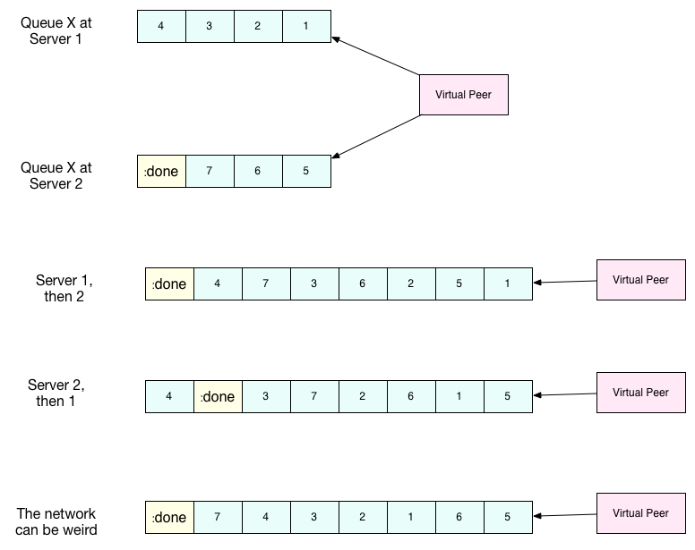
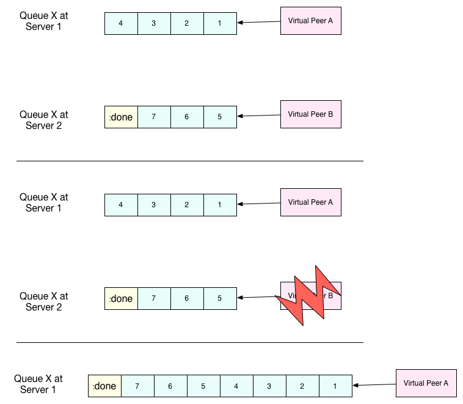

## Internal Design

This chapter outlines how Onyx works on the inside to meet the required properties of a distributed data processing system. This is not a formal proof nor an iron-clad specification for other implementations of Onyx. I will do my best to be transparent about how everything is working under the hood - good and bad. If something doesn't make sense, *keep moving*. There are inevitable forward references.

<!-- START doctoc generated TOC please keep comment here to allow auto update -->
<!-- DON'T EDIT THIS SECTION, INSTEAD RE-RUN doctoc TO UPDATE -->
**Table of Contents**  *generated with [DocToc](http://doctoc.herokuapp.com/)*

  - [High Level Components](#high-level-components)
    - [Peer](#peer)
    - [Virtual Peer](#virtual-peer)
    - [ZooKeeper](#zookeeper)
    - [HornetQ](#hornetq)
    - [The Log](#the-log)
    - [The Inbox and Outbox](#the-inbox-and-outbox)
  - [Applying Log Entries](#applying-log-entries)
  - [Joining the Cluster](#joining-the-cluster)
    - [3-Phase Cluster Join Strategy](#3-phase-cluster-join-strategy)
    - [Examples](#examples)
  - [Dead peer removal](#dead-peer-removal)
    - [Peer Failure Detection Strategy](#peer-failure-detection-strategy)
    - [Examples](#examples-1)
  - [Messaging](#messaging)
    - [HornetQ Single Server](#hornetq-single-server)
    - [HornetQ Cluster](#hornetq-cluster)
    - [Client Side Load Balancing](#client-side-load-balancing)
    - [Message Dispersal Under Failure](#message-dispersal-under-failure)
  - [Virtual Peer Task Execution](#virtual-peer-task-execution)
    - [Phases of Execution](#phases-of-execution)
    - [Pipelining](#pipelining)
    - [Local State](#local-state)
  - [Sentinel Values in a Distributed Setting](#sentinel-values-in-a-distributed-setting)
    - [Sentinel-in-the-Middle](#sentinel-in-the-middle)
    - [Leader Election](#leader-election)
  - [Garbage collection](#garbage-collection)
- [Command Reference](#command-reference)

<!-- END doctoc generated TOC please keep comment here to allow auto update -->

### High Level Components

#### Peer

A Peer is a node in the cluster responsible for processing data. It is similar to Storm's Worker node. A peer generally refers to a physical machine, though in the documentation, "peer" and "virtual peer" are often used interchangeably.

#### Virtual Peer

A Virtual Peer refers to a single peer process running on a single physical machine. Each virtual peer spawns about 15 threads to support itself since it is a pipelined process. All virtual peers are equal, whether they are on the same physical machine or not. Virtual peers *never* communicate with each other - they communicate with the log and HornetQ.

#### ZooKeeper

Apache ZooKeeper is used as storage and communication layer. ZooKeeper takes care of things like CAS, consensus, leader election, and sequential file creation. ZooKeeper watches are at the heart of how Onyx virtual peers detect machine failure.

#### HornetQ

HornetQ is employed for shuttling segments between virtual peers for processing. HornetQ is a queueing platform from the JBoss stack. HornetQ queues can cluster for scalability.

#### The Log

This design centers around a totally ordered sequence of commands using a log structure. The log acts as an immutable history and arbiter. It's maintained through ZooKeeper using a directory of persistent, sequential znodes. Virtual peers act as processes that consume from the log. At the time a peer starts up, it initializes its *local replica* to the "empty state". Log entries represent deterministic, idempontent functions to be applied to the local replica. The peer plays the log from the beginning, applying each log entry to its local replica. The local replica is transformed from one value to another. As a reaction to each replica transformation, the peer may send more commands to the tail of the log. Peers may play the log at any rate. After each peer has played `k` log entries, all peers at time `k` will have *exactly* the same local replica. Peers store everything in memory - so if a peer fails, it simply reboots from scratch with a new identifier and plays the log forward from the beginning. Since it has a new identifier, it has no association to its the commands it previously issued - preventing live lock issues.

#### The Inbox and Outbox

Every virtual peer maintains its own inbox and output. Messages received appear in order on the inbox, and messages to-be-sent are placed in order on the outbox.

Messages arrive in the inbox as commands are proposed into the ZooKeeper log. Technically, the inbox need only be size 1 since all log entries are processed strictly in order. As an optimization, the peer can choose to read a few extra commands behind the one it's current processing - hence the inbox will probably be configured with a size greater than one.

The outbox is used to send commands to the log. Certain commands processed by the peer will generate *other* commands. For example, if a peer is idle and it receives a command notifying it about a new job, the peer will *react* by sending a command to the log that it gets allocated for work. Each peer can choose to *pause* or *resume* the sending of its outbox messages. This is useful when the peer is just acquiring membership to the cluster. It will have to play log commands to join the cluster fully, but it cannot volunteer to be allocated for work since it's not officially yet a member of the cluster.

### Applying Log Entries

This section describes how log entries are applied to the peer's local replica. A log entry is a persistent, sequential znode. It's content is a map with keys `:fn` and `:args`. `:fn` is mapped to a keyword that finds this log entries implementation. `:args` is mapped to another map with any data needed to apply the log entry to the replica.

Peers begin with the empty state value, and local state. Local state maintains a mapping of things like the inbox and outbox - things that are specific to *this* peer, and presumably can't be serialized as EDN.

Each virtual peer starts a thread that listens for additions to the log. When it the log gets a new entry, the peer calls `onyx.extensions/apply-log-entry`. This is a function that takes a log entry and the replica, and returns a new replica with the log entry applied to it. This is a value-to-value transformation.

*A single peer begins with the empty replica (`{}`) and progressively applies log entries to the replica, advancing its state from one immutable value to the next.*

*A peer reads the first log entry and applies the function to its local replica, moving the replica into a state "as of" entry 0*

*Because application of functions from the log against the replica are deterministic and free of side effects, peers do not need to coordinate about the speed that each plays the log. Peers read the log on completely independent timelines*

Peers affect change in the world by reacting to log entries. When a log entry is applied, the peer calls `onyx.extensions/replica-diff`, passing it the old and new replicas. The peer produces a value summarization of what changed. This diff is used in subsequent sections to decide how to react and what side-effects to carry out.

Next, the peer calls `onyx.extensions/reactions` on the old/new replicas, the diff, and it's local state. The peer can decide to submit new entries back to the log as a reaction to the log entry it just saw. It might react to "submit-job" with "volunteer-for-task", for instance.

*After a peer reads a lot entry and applies it to the log replica, it will (deterministically!) react by appending zero or more log entries to the tail of the log.*

Finally, the peer can carry out side-effects by invoking `onyx.extensions/fire-side-effects!`. This function will do things like talking to ZooKeeper or writing to core.async channels. Isolating side effects means that a subset of the test suite can operate on pure functions alone. Each peer is tagged with a unique ID, and it looks for this ID in changes to its replica. The ID acts very much like the object orientated "this", in that it uses the ID to differentiate itself to conditionally perform side effects across an otherwise uniformly behaving distributed system.

### Joining the Cluster

Aside from the log structure and any strictly data/storage centric znodes, ZooKeeper will maintains another directory for pulses. Each virtual peer registers exactly one ephemeral node in the pulses directory. The name of this znode is a UUID.

#### 3-Phase Cluster Join Strategy

When a peer wishes to join the cluster, it must engage in a 3 phase protocol. Three phases are required because the peer that is joining needs to coordinate with another peer to change its ZooKeeper watch. I call this process "stitching" a peer into the cluster.

The technique needs peers to play by the following rules:
  - Every peer must be watched by another peer in ZooKeeper, unless there is exactly one peer in the cluster - in which cases there are no watches.
  - When a peer joins the cluster, all peers must form a "ring" in terms of who-watches-who. This makes failure repair very easy because peers can transitvely close any gaps in the ring after machine failure.
  - As a peer joining the cluster begins playing the log, it must buffer all reactive messages unless otherwise specified. The buffered messages are flushed after the peer has fully joined the cluster. This is because a peer could volunteer to perform work, but later abort its attempt to join the cluster, and therefore not be able to carry out any work.
  - A peer picks another peer to watch by determining a candidate list of peers it can stitch into. This candidate list is sorted by peer ID. The target peer is chosen by taking the message id modulo the number of peers in the sorted candidate list. The peer chosen can't be random because all peers will play the message to select a peer to stitch with, and they must all determine the same peer. Hence, the message modulo piece is a sort of "random seed" trick.

*At monotonic clock value t = 42, the replica has the above `:pairs` key, indicates who watches whom. As nodes are added, they maintain a ring formation so that every peer is watched by another.*

The algorithm works as follows:
- let S = the peer to stitch into the cluster
- S sends a `prepare-join-cluster` command to the log, indicating its peer ID
- S plays the log forward
- Eventually, all peers encounter `prepare-join-cluster` message that was sent by it
- if the cluster size (`n`) is `>= 1`:
  - let Q = this peer playing the log entry
  - let A = the set of all peers in the fully joined in the cluster
  - let X = the single peer paired with no one (case only when `n = 1`)
  - let P = set of all peers prepared to join the cluster
  - let D = set of all peers in A that are depended on by a peer in P
  - let V = sorted vector of `(set-difference (set-union A X) D)` by peer ID
  - if V is empty:
    - S sends an `abort-join-cluster` command to the log
    - when S encounters `abort-join-cluster`, it backs off and tries to join again later
  - let T = nth in V of `message-id mod (count V)`
  - let W = the peer that T watches
  - T adds a watch to S
  - T sends a `notify-join-cluster` command to the log, notifying S that it is watched, adding S to P
  - when S encounters `notify-join-cluster`:
    - it adds a watch to W
    - it sends a `accept-join-cluster` command, removing S from P, adding S to A
  - when `accept-join-cluster` has been encountered, this peer is part of the cluster
  - S flushes its outbox of commands
  - T drops it watch from W - it is now redundant, as S is watching Q
- if the cluster size is `0`:
  - S instantly becomes part of the cluster
  - S flushes its outbox of commands

*Peers 1 - 4 form a ring. Peer 5 wants to join. Continued below...*

*Peer 5 initiates the first phase of the join protocol. Peer 1 prepares to accept Peer 5 into the ring by adding a watch to it. Continued below...*

*Peer 5 initiates the second phase of the join protocol. Peer 5 notifies Peer 4 as a peer to watch. At this point, a stable "mini ring" has been stitched along the outside of the cluster. We note that the link between Peer 1 and 4 is extraneous. Continued below...*

*Peer 5 has been fully stitched into the cluster, and the ring is in tact*

#### Examples

- [Example 1: 3 node cluster, 1 peer successfully joins](/doc/design/join-examples/example-1.md)
- [Example 2: 3 node cluster, 2 peers successfully join](/doc/design/join-examples/example-2.md)
- [Example 3: 2 node cluster, 1 peer successfully joins, 1 aborts](/doc/design/join-examples/example-3.md)
- [Example 4: 1 node cluster, 1 peer successfully joins](/doc/design/join-examples/example-4.md)
- [Example 5: 0 node cluster, 1 peer successfully joins](/doc/design/join-examples/example-5.md)
- [Example 6: 3 node cluster, 1 peer fails to join due to 1 peer dying during 3-phase join](/doc/design/join-examples/example-6.md)
- [Example 7: 3 node cluster, 1 peer dies while joining](/doc/design/join-examples/example-7.md)

### Dead peer removal

Peers will fail, or be shut down purposefully. Onyx needs to:
- detect the downed peer
- inform all peers that this peer is no longer executing its task
- inform all peers that this peer is no longer part of the cluster

#### Peer Failure Detection Strategy

In a cluster of > 1 peer, when a peer dies another peer will have a watch registered on its znode to detect the ephemeral disconnect. When a peer fails (peer F), the peer watching the failed peer (peer W) needs to inform the cluster about the failure, *and* go watch the node that the failed node was watching (peer Z). The joining strategy that has been outlined forces peers to form a ring. A ring structure has an advantage because there is no coordination or contention as to who must now watch peer Z for failure. Peer W is responsible for watching Z, because W *was* watching F, and F *was* watching Z. Therefore, W transitively closes the ring, and W watches Z. All replicas can deterministicly compute this answer without conferring with each other.

*The nodes form a typical ring pattern. Peer 5 dies, and it's connection with ZooKeeper is severed. Peer 1 reacts by reporting Peer 5's death to the log. Continued below...*

*At t = 45, all of the replicas realize that Peer 5 is dead, and that Peer 1 is responsible for closing the gap by now watching Peer 4 to maintain the ring.*

*One edge case of this design is the simultaneous death of two or more consecutive peers in the ring. Suppose Peers 4 and 5 die at the exact same time. Peer 1 will signal Peer 5's death, but Peer 5 never got the chance to signal Peer 4's death. Continued below...*

*Peer 1 signals Peer 5's death, and closes to the ring by adding a watch to Peer 4. Peer 4 is dead, but no one yet knows that. We circumvent this problem by first determining whether a peer is dead or not before adding a watch to it. If it's dead, as is Peer 4 in this case, we report it and further close the ring. Continued below...*

*Peer 1 siginals peer 4's death, and further closes to the ring by adding a watch to Peer 3. The ring is now fully in-tact.*

#### Examples

- [Example 1: 4 node cluster, 1 peer crashes](/doc/design/leave-examples/example-1.md)
- [Example 2: 4 node cluster, 2 peers instantaneously crash](/doc/design/leave-examples/example-2.md)

### Messaging

#### HornetQ Single Server

Using a single HornetQ server, we are garunteed ordering of messages. Peers connect to the HornetQ server and consume messages.

#### HornetQ Cluster

In order to scale, we need a *cluster* of queues between each link the workflow. Using one queue would limit the network bandwidth to move data. HornetQ itself implements clustering, and some useful facts to know are:

- Each server in the cluster holds *its own* queue that participates in the cluster.
- Servers use *symetric* clustering. Every HornetQ server knows about every other HornetQ server.
- Producing messages onto a clustered queue will load balance them round-robin across all queues in the cluster.
- Consuming messages from a clustered queue will read them round-robin from all queues in the cluster.
- Producing and consuming messages happens in the context of a transaction.
- Transactions happen in the context of a HornetQ *session*.
- A session may be only manipulated by one thread at a time.

#### Client Side Load Balancing

During client side load balancing, messages can be read in a variety of ways. Below, we see a peer reading off of two HornetQ servers. Messages can be read starting at either server, causing at least two different streams of messages to be read. Round robin isn't a promise, though. The network may hiccup, and we might see messages in a completely jumbled up stream. Note, though, that individual queue messages are consistently ordered.

#### Message Dispersal Under Failure

As long as a HornetQ consumer is connected to a queue on a HornetQ server, it will be included in the round-robin message load balancing. If, however, the consumer disconnects and there are no other consumers, that queues messages are sent to another queue in the cluster. This prevents consumers on other queues being starved if they cannot access the messages on a machine with no open consumers. The messages are stacked on the back of other queues, again in a load balanced fashion:

### Virtual Peer Task Execution

One virtual peer may be executing at most executing one task. This section describes what activies the peer carries out during execution.

#### Phases of Execution

- Inject resources: Creates HornetQ session and opens transaction
- Read message batch: consumes and acknowledges messages off of HornetQ
- Decompress message batch: Uses Fressian's reader to obtain EDN maps of segments
- Strip sentinel: removes sentinel from decompressed batch if present
- Requeue sentine: Requeues the sentinel on the ingress queue if it is the leader
- Apply function: Apply fns to batches of segments
- Compress message batch: Uses Fressian's writer to compress segments to bytes
- Write message batch: Writes messages to HornetQ
- Commit transaction: Commits the transaction to HornetQ
- Close resources: Closes open connections and sockets
- Reset payload: Rotates the znode this virtual peer is listening on for new tasks
- Seal egress queue: If this virtual peer is allowed, propagates the sentinel to the egress queues
- Update local listeners: Rotates listeners for ZooKeeper for the next task

#### Pipelining

The Peer process is extensively pipelined for performance reasons. As it turns out, Onyx's peer faces the same situation as Datomic's transactor. You can listen to Rich talk about it [here](http://www.infoq.com/presentations/Datomic) (36:05).

To talk about why this helps, we need an understanding of what properties Onyx requires to be correct and how HornetQ works. Onyx offers both concurrent and sequential processing. In the case of sequential processing, it's critical that we never jumble up the order that the messages are streamed in.

When we produce and consume messages using HornetQ, we do so in the context of a "session". Onyx strictly uses transactional HornetQ sessions. That means we can move messages between queues *atomically*. That's how Onyx is able to offer it's transactional semantics. HornetQ sessions, as it ends up, are hostile to being accessed by multiple threads. In fact, HornetQ sessions have built in detection for being accessed concurrently. An exception will be thrown indicating that this is happening.

So in order to go fast and preserve message order for sequential processing, we *pipeline* the virtual peer. The trick with HornetQ is to understand that it's not the case that a session only ever needs to run on one thread - but that only a single thread can be using the session at an instance in time. In the case of using a session strictly serially as you suggested, we would: open the session, start the transaction, read messages off the queue, decompress messages, apply functions to messages, compress messages, and write messages back to the queue. There are more steps, but the point is that each of these steps can run on their *own* thread. The first step of the pipeline is to create a HornetQ session. Since each stage of the pipeline can only operate on one thing at a time, we're guaranteed that each HornetQ session is isolated to one thread at a time. At the same time, the process is still basically serial. Messages are processed in order. This is how Onyx efficiently utilizes all the cores of the box. If the box has 4 cores with 4 hyper-threads, 16 concurrent activities can run without much CPU contention.

There is one other thing I'd like to point out. Pipelining definitely is trickier to do correctly. We have to worry about things like flushing values and closing sessions sequentially down the pipeline for a clean shutdown. That being said, there are a whole bag of neat testing tricks you can play when each activity is isolated to its own thread. The activities are now *temporally* decoupled - they all run on their own timelines. Connecting these with core.async channels that are multiplexed means that you can add additional listeners, or *spies*, if you will, in your test code. You can monitor the values that are being passed through the pipeline. You can work with each activity independently since they are fully decoupled.

#### Local State

Each virtual peer's task lifecycle maintains one atom that it uses for local state. It is a map that has a key for whether it has ever asked to seal, and a key for what the sentinel leader is. The latter is used as a local cache, whereas the former is used to avoid deadlock. Virtual peers can ask to seal exactly once. Subsequent requests are ignored. Since this process is pipelined, we need a way to convey this information *backwards* through the pipeline. The shared atom accomplishes this.

### Sentinel Values in a Distributed Setting

One of the challenges in working with distributed systems is the property that messages can be delayed, duplicated, dropped, and reordered. For the most part, HornetQ's transactions aid with a lot of these concerns. One particularly difficult point, though, is the notion of "sealing". In order to propagate the sentinel value from one queue to the next, all of the segments must be processed. This is the key attribute that allows for at-least-once processing semantics. Unfortunately, inbetween the time that each peer asks if it can seal, and by time it actually does seal and reports back, the peer can be fail. Worse yet, we have no way of knowing whether it successfully wrote the sentinel to the next queue. Therefore, we need to make this operation idemponent and handle multiple sentinel values. We also need to be able to handle sentinel values that appear in the middle of the queue due to the way HornetQ load balances.

#### Sentinel-in-the-Middle

As shown above, the sentinel value can easily sneak into the middle of a queue. Obviously, a sentinel found in the middle of the queue doesn't actually mark the end of a workload. Onyx combats this by querying the queue cluster for the total number of messages across all queues in this cluster. If this number is not *1* (just the sentinel that we're holding at present), there are presumably more segments behind it that need to be processed.

We could requeue this sentinel and place it at the back of the queue. If we did this, though, we would spin into an infinite loop in the presence of multiple sentinel values. Instead, we *reduce* the number of sentinel values. We pick one sentinel value as the "leader", and drop all other sentinels. The leader is always requeued at the back. Eventually, we find the end and propagate the sentinel value to the egress queues.

#### Leader Election

Each sentinel value is marked with metadata when it is put on HornetQ. Specifically, each sentinel carries a UUID to uniquely identify it. When a peer encounters a sentinel for the first time in its lifecycle of a task, it tries to write the UUID of the sentinel to ZooKeeper. The semantics of ZooKeeper are such that multiple writers can try to write to the same znode, but only one will suceed. This guaruntees that exactly one leader will be picked. After the peer writes, or votes, for the UUID, it immediately reads from ZooKeeper to see what the leaders UUID is. It caches the leader's UUID locally, since it will not change. If the sentinel it is holding matches the leader's UUID, it requeues the sentinel so that others may find it. If it does not match, the sentinel is discarded. Hence, the number of sentinels on an ingress queue converges towards 1.

### Garbage collection

One of the primary obstacles that this design imposes is the requirement of seemingly infinite storage. Log entries are only ever appended - never mutated. If left running long enough, ZooKeeper will run out of space. Similiarly, if enough jobs are submitted and either completed or killed, the in memory replica that each peer houses will grow too large. Onyx requires a garbage collector to be periodically invoked.

When the garbage collector is invoked, two things will happen. The caller of gc will place an entry onto the log. As each peer processed this log entry, it carries out a deterministic, pure function to shrink the replica. The second thing will occur when each peer invokes the side effects for this log entry. The caller will have specified a unique ID such that it is the only one that is allowed to trim the log. The caller will take the current replica (log entry N to this log entry), and store it in an "origin" znode. Anytime that a peer boots up, it first reads out of the origin location. Finally, the caller deletes log entry N to this log entry minus 1. This has the dual effect of making new peers start up faster, as they have less of the log to play. They begin in a "hot" state.

The garbage collector can be invoked by the public API function `onyx.api/gc`. Upon returning, the log will be trimmed, and the in memory replicas will be compressed.

*A peer can start by reading out of the origin, and continue directly to a particular log location.*

## Command Reference

-------------------------------------------------
[`prepare-join-cluster`](https://github.com/MichaelDrogalis/onyx/blob/0.5.x/src/onyx/log/commands/prepare_join_cluster.clj)

- Submitter: peer (P) that wants to join the cluster
- Purpose: determines which peer (Q) that will watch P. If P is the only peer, it instantly fully joins the cluster
- Arguments: P's ID
- Replica update: assoc `{Q P}` to `:prepare` key. If P is the only P, P is immediately added to the `:peers` key, and no further reactions are taken
- Side effects: Q adds a ZooKeeper watch to P's pulse node
- Reactions: Q sends `notify-join-cluster` to the log, with args P and R (R being the peer Q watches currently)

-------------------------------------------------
[`notify-join-cluster`](https://github.com/MichaelDrogalis/onyx/blob/0.5.x/src/onyx/log/commands/notify_join_cluster.clj)

- Submitter: peer Q helping to stitch peer P into the cluster
- Purpose: Add's a watch from P to R, where R is the node watched by Q
- Arguments: P and R's ids
- Replica update: assoc `{Q P}` to `:accept` key, dissoc `{Q P}` from `:prepare` key
- Side effects: P adds a ZooKeeper watch to R's pulse node
- Reactions: P sends `accept-join-cluster` to the log, with args P, Q, and R

-------------------------------------------------
[`accept-join-cluster`](https://github.com/MichaelDrogalis/onyx/blob/0.5.x/src/onyx/log/commands/accept_join_cluster.clj)

- Submitter: peer P wants to join the cluster
- Purpose: confirms that P can safely join, Q can drop its watch from R, since P now watches R, and Q watches P
- Arguments: P, Q, and R's ids
- Replica update: dissoc `{Q P}` from `:accept` key, merge `{Q P}` and `{P R}` into `:pairs` key, conj P onto the `:peers` key
- Side effects: Q drops its ZooKeeper watch from R
- Reactions: peer P flushes its outbox of messages

-------------------------------------------------
[`abort-join-cluster`](https://github.com/MichaelDrogalis/onyx/blob/0.5.x/src/onyx/log/commands/abort_join_cluster.clj)

- Submitter: peer (Q) determines that peer (P) cannot join the cluster (P may = Q)
- Purpose: Aborts P's attempt at joining the cluster, erases attempt from replica
- Arguments: P's id
- Replica update: Remove any `:prepared` or `:accepted` entries where P is a key's value
- Side effects: P optionally backs off for a period
- Reactions: P optionally sends `:prepare-join-cluster` to the log and tries again

-------------------------------------------------
[`leave-cluster`](https://github.com/MichaelDrogalis/onyx/blob/0.5.x/src/onyx/log/commands/leave_cluster.clj)

- Submitter: peer (Q) reporting that peer P is dead
- Purpose: removes P from `:prepared`, `:accepted`, `:pairs`, and/or `:peers`, transitions Q's watch to R (the node P watches) and transitively closes the ring
- Arguments: peer ID of P
- Replica update: assoc `{Q R}` into the `:pairs` key, dissoc `{P R}`
- Side effects: Q adds a ZooKeeper watch to R's pulse node

-------------------------------------------------
[`volunteer-for-task`](https://github.com/MichaelDrogalis/onyx/blob/0.5.x/src/onyx/log/commands/volunteer_for_task.clj)

- Submitter: peer (P) that wants to execute a new task
- Purpose: P is possibly available to execute a new task because a new job was submitted, or the cluster size changed - depending on the job and task schedulers
- Arguments: peer ID of P
- Replica update: Updates `:allocations` with peer ID under the chosen job and task, if any. Switches `:peer-state` for this peer to `:active` if a task is chosen
- Side effects: Stop the current task lifecycle, if one is running. Starts a new task lifecycle for the chosen task
- Reactions: None

-------------------------------------------------
[`seal-task`](https://github.com/MichaelDrogalis/onyx/blob/0.5.x/src/onyx/log/commands/seal_task.clj)

- Submitter: peer (P), who has seen the leader sentinel
- Purpose: P wants to propagate the sentinel to all downstream tasks
- Arguments: P's ID (`:id`), the job ID (`:job`), and the task ID (`:task`)
- Replica update: If this peer is allowed to seal, updates `:sealing-task` with the task ID associated this peers ID.
- Side effects: Puts the sentinel value onto the queue
- Reactions: None

-------------------------------------------------
[`complete-task`](https://github.com/MichaelDrogalis/onyx/blob/0.5.x/src/onyx/log/commands/complete_task.clj)

- Submitter: peer (P), who has successfully sealed the task
- Purpose: Indicates to the replica that all downstream tasks have received the sentinel, so this task can be marked complete
- Arguments: P's ID (`:id`), the job ID (`:job`), and the task ID (`:task`)
- Replica update: Updates `:completions` to associate job ID to a vector of task ID that have been completed. Removes all peers under `:allocations` for this task. Sets `:peer-state` for all peers executing this task to `:idle`
- Side effects: Stops this task lifecycle
- Reactions: Any peer executing this task reacts with `:volunteer-for-task`

-------------------------------------------------
[`submit-job`](https://github.com/MichaelDrogalis/onyx/blob/0.5.x/src/onyx/log/commands/submit_job.clj)

- Submitter: Client, via public facing API
- Purpose: Send a catalog and workflow to be scheduled for execution by the cluster
- Arguments: The job ID (`:id`), the task scheduler for this job (`:task-scheduler`), a topologically sorted sequence of tasks (`:tasks`), the catalog (`:catalog`), and the saturation level for this job (`:saturation`). Saturation denotes the number of peers this job can use, at most. This is typically Infinity, unless all catalog entries set `:onyx/max-peers` to an integer value. Saturation is then the sum of those numbers, since it creates an upper bound on the total number of peers that can be allocated to this task.
- Replica update: 
- Side effects: None
- Reactions: If the job scheduler dictates that this peer should be reallocated to this job or another job, sends `:volunteer-for-task` to the log

-------------------------------------------------
[`kill-job`](https://github.com/MichaelDrogalis/onyx/blob/0.5.x/src/onyx/log/commands/kill_job.clj)

- Submitter: Client, via public facing API
- Purpose: Stop all peers currently working on this job, and never allow this job's tasks to be scheduled for execution again
- Arguments: The job ID (`:job`)
- Replica update: Adds this job id to `:killed-jobs` vector, removes any peers in `:allocations` for this job's tasks. Switches the `:peer-state` for all peer's executing a task for this job to `:idle`.
- Side effects: If this peer is executing a task for this job, stops the current task lifecycle
- Reactions: If this peer is executing a task for this job, reacts with `:volunteer-for-task`

-------------------------------------------------
[`gc`](https://github.com/MichaelDrogalis/onyx/blob/0.5.x/src/onyx/log/commands/gc.clj)

- Submitter: Client, via public facing API
- Purpose: Compress all peer local replicas and trim old log entries in ZooKeeper.
- Arguments: The caller ID (`:id`)
- Replica update: Clears out all data in all keys about completed and killed jobs - as if they never existed.
- Side effects: Deletes all log entries before this command's entry, creates a compressed replica at a special origin log location, and updates to the pointer to the origin
- Reactions: None

-------------------------------------------------

